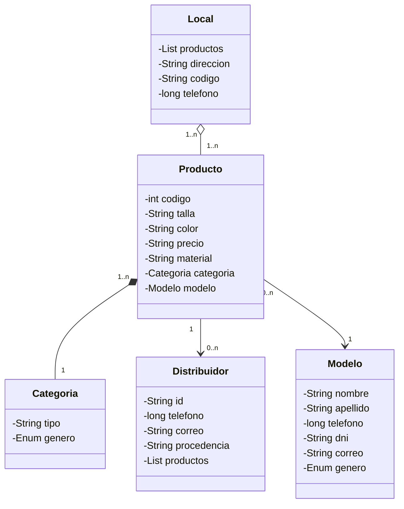

# Proyecto Shein

## Descripción

Este proyecto es una aplicación Java diseñada para gestionar productos de una tienda de moda ficticia llamada Shein. La aplicación permite manejar un catálogo de productos de moda, incluyendo información detallada sobre cada artículo como código, talla, color, precio, material, modelo que lo presenta, categoría y distribuidores asociados.

La aplicación está construida siguiendo principios de Programación Orientada a Objetos (POO) y utiliza un patrón DAO (Data Access Object) para la gestión de datos. Incluye una interfaz de consola simple para probar las funcionalidades principales.

### Características Principales

- **Gestión de Productos**: Crear y consultar productos con atributos completos.
- **Modelos de Datos**: Clases para representar productos, categorías, distribuidores, modelos (fashion models) y locales.
- **Operaciones DAO**: Métodos para obtener productos aleatorios, listar todos los productos, buscar por código y limpiar la lista.
- **Interfaz de Consola**: Menú interactivo para probar las funcionalidades.
- **Pruebas Unitarias**: Cobertura de pruebas con JUnit 5.

## Arquitectura y Diseño

### Diagrama de Clases



### Estructura del Proyecto

```
src/
├── main/java/org/palomafp/shein/
│   ├── App.java                          # Clase principal con menú de consola
│   ├── ProductosDAO.java                 # DAO para gestión de productos
│   └── modelo/
│       ├── Producto.java                 # Clase modelo para productos
│       ├── Categoria.java                # Clase modelo para categorías
│       ├── Distribuidor.java             # Clase modelo para distribuidores
│       ├── Modelo.java                   # Clase modelo para modelos (fashion)
│       └── Local.java                    # Clase modelo para locales
└── test/java/org/palomafp/shein/
    ├── AppTest.java                      # Pruebas para la clase App
    └── ProductosDAOTest.java             # Pruebas para el DAO
```

## Requisitos del Sistema

- **Java**: Versión 21 o superior
- **Maven**: Para gestión de dependencias y construcción del proyecto
- **Sistema Operativo**: Compatible con Windows, macOS y Linux

## Instalación y Configuración

1. **Clonar el repositorio**:
   ```bash
   git clone <url-del-repositorio>
   cd shein
   ```

2. **Compilar el proyecto**:
   ```bash
   mvn clean compile
   ```

3. **Ejecutar la aplicación**:
   ```bash
   mvn exec:java -Dexec.mainClass="org.palomafp.shein.App"
   ```

4. **Ejecutar pruebas**:
   ```bash
   mvn test
   ```

## Uso

Al ejecutar la aplicación, se presenta un menú de consola con las siguientes opciones:

1. **Devolver un producto aleatorio**: Muestra un producto seleccionado aleatoriamente del catálogo.
2. **Devolver la lista de todos los productos**: Lista todos los productos disponibles.
3. **Devolver un producto por su código**: Permite buscar un producto específico introduciendo su código numérico.
4. **Salir del programa**: Finaliza la ejecución.

### Ejemplo de Salida

```
=== PRUEBA DE CLASES SHEIN ===
1. Devolver un producto aleatorio
2. Devolver la lista de todos los productos
3. Devolver un producto por su código
0. Salir del programa
Introduce una opción: 1

Producto{codigo=1001, talla='M', color='Rojo', precio='19.99€', material='Algodón', modelo=Modelo{nombre='Lucía', apellido='García', ...}, categoria=Categoria{tipo='Camisetas', genero=FEMENINO}, distribuidor=[Distribuidor{id='D001', ...}]}
```

## API del DAO

La clase `ProductosDAO` proporciona los siguientes métodos públicos:

- `Producto getProductoRandom()`: Devuelve un producto aleatorio de la lista.
- `List<Producto> getAllProductos()`: Devuelve la lista completa de productos.
- `Producto getProductoByCodigo(Integer codigo)`: Busca y devuelve un producto por su código.
- `List<Producto> clearAll()`: Limpia toda la lista de productos (útil para pruebas).

## Pruebas

El proyecto incluye pruebas unitarias usando JUnit 5. Para ejecutarlas:

```bash
mvn test
```

Las pruebas cubren:
- Funcionalidad del DAO (`ProductosDAOTest.java`)
- Clase principal (`AppTest.java`)

## Dependencias

- **JUnit 5.11.0**: Framework de pruebas unitarias (solo en ámbito de test)

## Contribución

1. Fork el proyecto.
2. Crea una rama para tu feature (`git checkout -b feature/nueva-funcionalidad`).
3. Commit tus cambios (`git commit -am 'Añade nueva funcionalidad'`).
4. Push a la rama (`git push origin feature/nueva-funcionalidad`).
5. Abre un Pull Request.

### Guías de Estilo

- Sigue las convenciones de código Java estándar.
- Añade documentación Javadoc a métodos públicos.
- Incluye pruebas unitarias para nuevas funcionalidades.

## Licencia

Este proyecto está bajo la Licencia MIT. Ver el archivo `LICENSE` para más detalles.

## Autores

- **Noelia Jorquera**
- **Samuel Pérez**

## Agradecimientos

Proyecto desarrollado como parte de un curso de Programación Orientada a Objetos en Java.