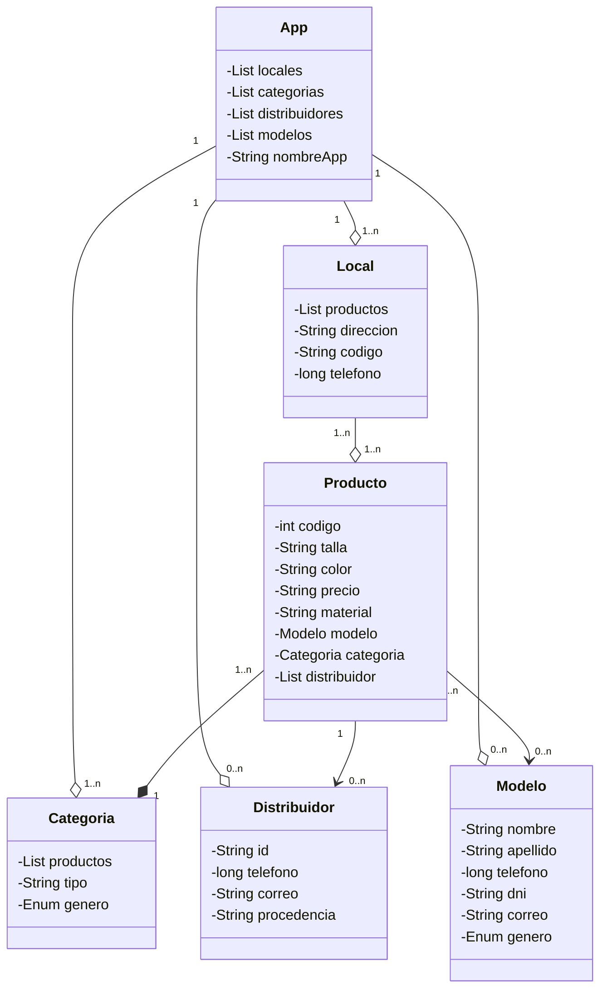

```mermaid


classDiagram


    App "1" --o "1..n" Local
    App "1" --o "1..n" Categoria
    App "1" --o "0..n" Distribuidor
    App "1" --o "0..n" Modelo
    Producto "1..n" --* "1" Categoria
    Producto "1" --> "0..n" Distribuidor
    Producto "0..n" --> "0..n" Modelo
    Local "1..n" --o "1..n" Producto


    class App {
        -List<Local> locales
        -List<Categoria> categorias
        -List<Distribuidor> distribuidores
        -List<Modelo> modelos
        -String nombreApp
    }


    class Producto {
        -int codigo
        -String talla
        -String color
        -String precio
        -String material
        -Modelo modelo
        -Categoria categoria
        -List<Distribuidor> distribuidor
    }


    class Categoria {
        -List<Producto> productos
        -String tipo
        -Enum genero
    }


    class Distribuidor {
        -String id
        -long telefono
        -String correo
        -String procedencia
    }


    class Modelo {
        -String nombre
        -String apellido
        -long telefono
        -String dni
        -String correo
        -Enum genero
    }


    class Local {
        -List<Producto> productos
        -String direccion
        -String codigo
        -long telefono
    }


```
